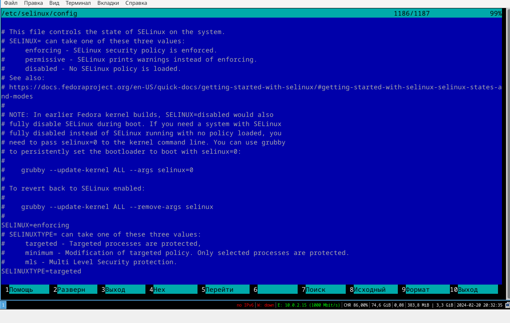
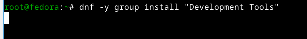

---
## Front matter
lang: ru-RU
title: Презентация по лабораторной работе №1
subtitle: Архитектура компьютеров и операционные системы
author:
  - Вакутайпа М.
institute:
  - Российский университет дружбы народов, Москва, Россия
date: 25 февраля 2024

## i18n babel
babel-lang: russian
babel-otherlangs: english

## Formatting pdf
toc: false
toc-title: Содержание
slide_level: 2
aspectratio: 169
section-titles: true
theme: metropolis
header-includes:
 - \metroset{progressbar=frametitle,sectionpage=progressbar,numbering=fraction}
 - '\makeatletter'
 - '\beamer@ignorenonframefalse'
 - '\makeatother'
---

# Цель работы

Целью данной работы является приобретение практических навыков установки операционной системы на виртуальную машину, настройки минимально необходимых для дальнейшей работы сервисов.

# Задание

- Создание виртуальной машины
- Установка операционной системы
- Установка драйверов для VirtualBox
- Настройка раскладки клавиатуры
- Установка имени пользователя и названия хоста
- Установка программного обеспечения для создания документации

##Создание виртуальной машины

- Запускаю VirtualBox:

{#fig:001 width=70%}

- Задаю имя машины и добавляю новый привод оптических дисков и выбираю образ: 

{#fig:002 width=70%}

- Указиваю размер основной памяти виртуальной машины:

{#fig:003 width=70%}

- Задаю размер диска — 100 ГБ:

{#fig:004 width=70%}

##Установка операционной системы

- Нажимаю комбинацию Win+Enter для запуска терминала. В терминале запускаю liveinst:

{#fig:006 width=70%}

- Выбираю язык интерфейса и перехожу к настройкам установки операционной системы:

{#fig:007 width=70%}

- Место установки ОС оставляю без изменения:

{#fig:008 width=70%}

- Установляю имя и пароль пользователя:

{#fig:009 width=70%}

##Установка драйверов для VirtualBox

- Переключаюсь на роль супер-пользователя и обновляю все пакеты:

{#fig:0010 width=70%}

- Установливаю программы для удобства работы в консоли:

{#fig:0011 width=70%}

- Установливаю программного обеспечения для автоматического обновления:

{#fig:0012 width=70%}

- Запускаю таймер:

{#fig:0013 width=70%}

- Я не буду рассматривать работу с системой безопасности SELinux, поэтому отключим его:

{#fig:0014 width=70%}

- Запускаю терминальный мультиплексор tmux, переключаюсь на роль супер-пользователя используя sudo -i и установляю средства разработки:

{#fig:0015 width=70%}

- Установливаю пакет DKMS используя dnf -y install dkms. В меню виртуальной машины подключаю образ диска дополнений гостевой ОС:

{#fig:0016 width=70%}

- Далее установливаю драйвера указав /media/VBoxLinuxAdditions.run и перегружаю виртуальную машину.

##Настройка раскладки клавиатуры

- Запускаю терминальный мультиплексор tmux. Создаю конфигурационный файл.
- Отредактирую конфигурационный файл и переключаюсь на роль супер-пользователя:

{#fig:0017 width=70%}

{#fig:0017 width=70%}

{#fig:0017 width=70%}

##Установка имени пользователя и названия хоста

- Запукаю виртуальную машину и залогинуюсь. Нажимаю комбинацию Win+Enter для запуска терминала. Запускаю терминальный мультиплексор tmux. Переключаюсь на роль супер-пользователя. Создаю пользователя и задаю пароль для пользователя:

{#fig:0018 width=70%}

- Проверяю, что имя хоста установлено верно:

{#fig:0019 width=70%}

##Установка программного обеспечения для создания документации

- Установливаю pandoc с помощью менеджера пакетов:

{#fig:0021 width=70%}

- Установливаю TexLive с помощью менеджера пакетов:

{#fig:0022 width=70%}

# Выводы

При выполнении проделанной работы я приобретела практические навыки установки операционной системы на виртуальную машину, настройки минимально необходимых для дальнейшей работы сервисов.
