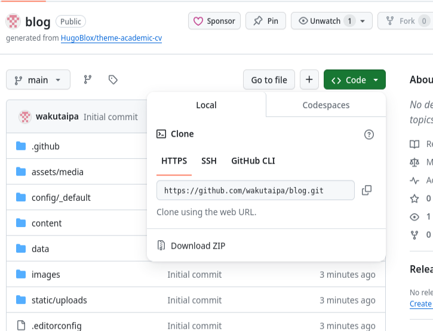
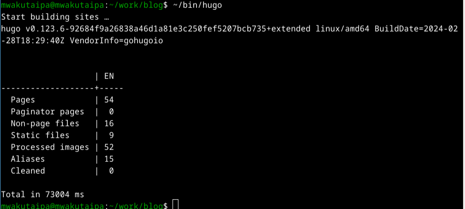
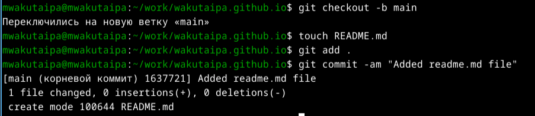
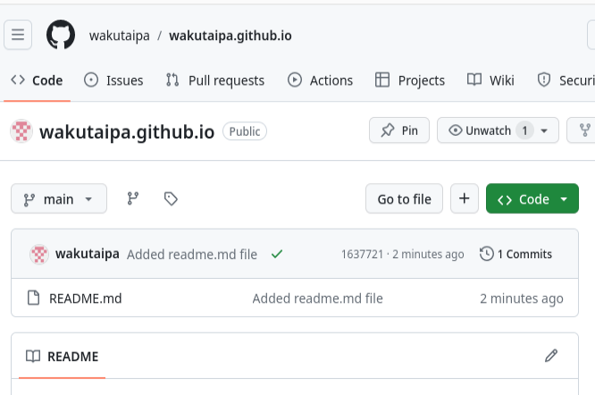
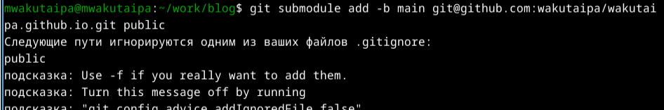

---
## Front matter
lang: ru-RU
title: Презентация по первому этапу проекту
subtitle: Архитектура компьютеров и операционные системы
author:
  - Вакутайпа М.
institute:
  - Российский университет дружбы народов, Москва, Россия
date: 28 февраля 2024

## i18n babel
babel-lang: russian
babel-otherlangs: english

## Formatting pdf
toc: false
toc-title: Содержание
slide_level: 2
aspectratio: 169
section-titles: true
theme: metropolis
header-includes:
 - \metroset{progressbar=frametitle,sectionpage=progressbar,numbering=fraction}
 - '\makeatletter'
 - '\beamer@ignorenonframefalse'
 - '\makeatother'
---

# Цель работы

- Цель этой работы - научиться создавать и размещать веб-страниц на github.

# Задание

- Загрузка шаблоны
- Создать репозиторий
- Разместить веб-сайт на github

## Загрузка шаблоны

- Я захожу на веб-сраницу HTML5UP, где есть бесплатные шаблоны веб-сайтов

{#fig:001 width=70%}

{#fig:002 width=70%}

## Создание репозитория

- Создаю новый репозиторий на git:

{#fig:004 width=70%}

- Через терминал клонирую репозиторий в директорий personal-project/project 1:

{#fig:005 width=70%}

- Перехожу в этот же директорий и создаю конфигурационный файл:

{#fig:007 width=70%}

- Установливаю параметры:

{#fig:008 width=70%}

- Распаковываю загруженный zip-файл и перемещаю содержимое в директорий personal-project/project 1:

{#fig:009 width=70%}

## Размещение веб-сайта на github

- Осуществляю все файлы на репозиторий в github с помощью git remote add:

{#fig:0011 width=70%}

{#fig:0012 width=70%}

{#fig:0013 width=70%}

- С помощью git commit и git push я размешаю все изминения на git:

{#fig:0014 width=70%}

- Настраиваю github pages с помощью git remote set-url:

{#fig:0015 width=70%}

- Возвращаюсь в созданный мной репозиторий, нажимаю вкладку настройки и перехожу на github pages:
 
{#fig:0016 width=70%}

- Настраиваю для ветки значение и перезагружаю страницу:

{#fig:0017 width=70%}

- Теперь появилась ссылка на мою веб-сраницу:

{#fig:0018 width=70%}

{#fig:0019 width=70%}

# Выводы

При выполнение данного этапа проекта, я освоила хостинг веб-сттраниц на github.
