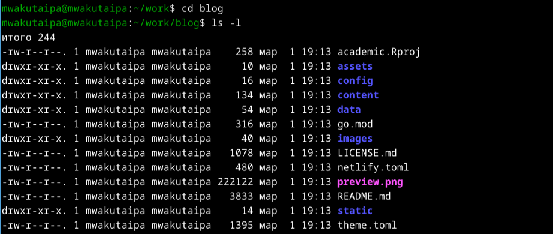
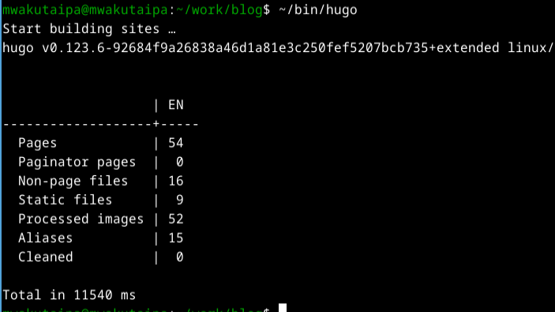

---
## Front matter
lang: ru-RU
title: Презентация по первому этапу индивидуального проекта
subtitle: Архитектура компьютеров и операционные системы
author:
  - Вакутайпа М.
institute:
  - Российский университет дружбы народов, Москва, Россия
date: 01 Марта 2024

## i18n babel
babel-lang: russian
babel-otherlangs: english

## Formatting pdf
toc: false
toc-title: Содержание
slide_level: 2
aspectratio: 169
section-titles: true
theme: metropolis
header-includes:
 - \metroset{progressbar=frametitle,sectionpage=progressbar,numbering=fraction}
 - '\makeatletter'
 - '\beamer@ignorenonframefalse'
 - '\makeatother'
---

# Цель работы

Быстрое развертывание сайта на GitHub Pages с помощью генератора статического html Hugo.

# Задание

- Установка программного обеспечения
- Установка темы
- Публикация сайта

# Выполнение работы

## Установка программного обеспечения

- Установливаю программу вручную с репозитория на Github:

{#fig:001 width=70%}

## Установка программного обеспечения

- Распаковаю программу и копирую её в bin:

{#fig:002 width=70%}

## Установка программного обеспечения

- По шаблону Academic-cv создаю новый репозиторий blog:

{#fig:003 width=70%}

## Установка программного обеспечения

- Клонирую репозиторий, который содержит структуру сайта в каталог work/blog :

{#fig:004 width=70%}

## Установка программного обеспечения

- Перехожу в этот же каталог и проверяю с помощью ls -l:

{#fig:005 width=70%}

## Установка темы

- Запускаю hugo:

{#fig:006 width=70%}

## Установка темы

- Запускаю программу с командой server, чтобы видеть сайт на локальный сервер:

## Установка темы

{#fig:007 width=70%}

## Установка темы

{#fig:008 width=70%}

## Установка темы

- Создаю еще один репозиторий имя, которое является адресом сайта:

{#fig:009 width=70%}

## Установка темы

- Клонирую созданный репозиторий, который храняется у себя в каталог wakutaipa.github.io:

{#fig:0010 width=70%}

## Установка темы

- Создаю новую ветку с именем main:

{#fig:0011 width=70%}

## Публикация сайта

- Создаю пустой файл readme.md и отправляю на глобальный репозиторий:

{#fig:0012 width=70%}

## Публикация сайта

- Комментирую public с помощью mc в .gitignore чтобы каталоги с таким названием не игнорировались:

{#fig:0013 width=70%}

## Публикация сайта

- Добавляю репозиторий к каталогу с помощью git submodule add:

{#fig:0014 width=70%}

## Публикация сайта

- Запускаю hugo, чтобы заполнить созданный каталог:

{#fig:0015 width=70%}

## Публикация сайта

- Провеяю подключение между созданным каталогом и wakutaipa.github.io:

{#fig:0016 width=70%}

## Публикация сайта

Далее отправляю все файлы на github:

{#fig:0017 width=70%}

## Публикация сайта

{#fig:0018 width=70%}

## Публикация сайта

{#fig:0019 width=70%}

# Выводы

При выполнении данной работы я научилась, как развмещать сайт на GitHub Pages с помощью генератора статического html Hugo.
