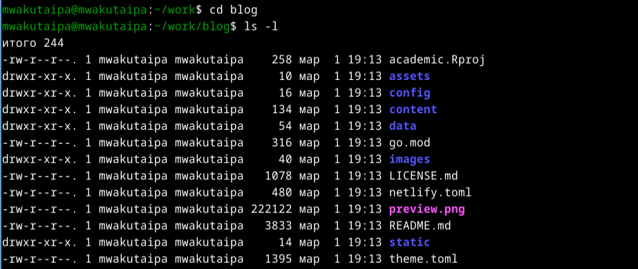
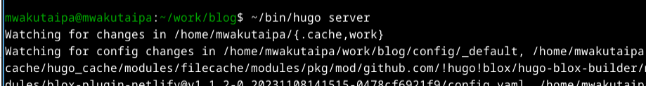

---
## Front matter
title: "Отчёт по первому этапу проекту"
subtitle: "Архитектура компьютеров и операционные системы"
author: "Вакутайпа Милдред"

## Generic otions
lang: ru-RU
toc-title: "Содержание"

## Bibliography
bibliography: bib/cite.bib
csl: pandoc/csl/gost-r-7-0-5-2008-numeric.csl

## Pdf output format
toc: true # Table of contents
toc-depth: 2
lof: true # List of figures
lot: true # List of tables
fontsize: 12pt
linestretch: 1.5
papersize: a4
documentclass: scrreprt
## I18n polyglossia
polyglossia-lang:
  name: russian
  options:
	- spelling=modern
	- babelshorthands=true
polyglossia-otherlangs:
  name: english
## I18n babel
babel-lang: russian
babel-otherlangs: english
## Fonts
mainfont: PT Serif
romanfont: PT Serif
sansfont: PT Sans
monofont: PT Mono
mainfontoptions: Ligatures=TeX
romanfontoptions: Ligatures=TeX
sansfontoptions: Ligatures=TeX,Scale=MatchLowercase
monofontoptions: Scale=MatchLowercase,Scale=0.9
## Biblatex
biblatex: true
biblio-style: "gost-numeric"
biblatexoptions:
  - parentracker=true
  - backend=biber
  - hyperref=auto
  - language=auto
  - autolang=other*
  - citestyle=gost-numeric
## Pandoc-crossref LaTeX customization
figureTitle: "Рис."
tableTitle: "Таблица"
listingTitle: "Листинг"
lofTitle: "Список иллюстраций"
lotTitle: "Список таблиц"
lolTitle: "Листинги"
## Misc options
indent: true
header-includes:
  - \usepackage{indentfirst}
  - \usepackage{float} # keep figures where there are in the text
  - \floatplacement{figure}{H} # keep figures where there are in the text
---

# Цель работы

Цель этой работы - научиться создавать и размещать веб-страниц на github.

# Задание

- Загрузка шаблоны
- Создать репозиторий
- Разместить веб-сайт на github

# Выполнение работы

## Загрузка шаблоны

Я захожу на веб-сраницу [HTML5UP]{https://html5up.net/}, где есть бесплатные шаблоны веб-сайтов, и загружаю тот ,который мне нравится в виде зип-файл:

{#fig:001 width=70%}

{#fig:002 width=70%}

## Создание репозитория

Создаю новый репозиторий на git:

{#fig:004 width=70%}

Открываю терминал и клонирую репозиторий в директорий personal-project/project 1:

{#fig:005 width=70%}

Перехожу в этот же директорий и создаю конфигурационный файл:

{#fig:007 width=70%}

Установливаю параметры:

{#fig:008 width=70%}

Распаковываю загруженный zip-файл и перемещаю содержимое в директорий personal-project/project 1:

{#fig:009 width=70%}

Проверяю с помощью ls:

{#fig:0010 width=70%}

## Размещение веб-сайта на github

Осуществляю все файлы на репозиторий в github с помощью git remote add:

{#fig:0011 width=70%}

Git запросил авторизоться. Я делаю это с помощью gh auth login:

{#fig:0012 width=70%}

{#fig:0013 width=70%}

С помощью git commit и git push я размешаю все изминения на git:

{#fig:0014 width=70%}

Настраиваю github pages с помощью git remote set-url:

{#fig:0015 width=70%}

Возвращаюсь в созданный мной репозиторий, нажимаю вкладку настройки и перехожу на github pages:
 
{#fig:0016 width=70%}

Настраиваю для ветки значение и перезагружаю страницу:

{#fig:0017 width=70%}

Теперь появилась ссылка на мою веб-сраницу:

{#fig:0018 width=70%}

{#fig:0019 width=70%}

# Выводы

При выполнение данного этапа проекта, я освоила хостинг веб-сттраниц на github.

# Список литературы{.unnumbered}

[HTML5UP](https://html5up.net/)

[CodingTheSmartWay](https://www.codingthesmartway.com/how-to-host-a-website-on-github-for-free/)
