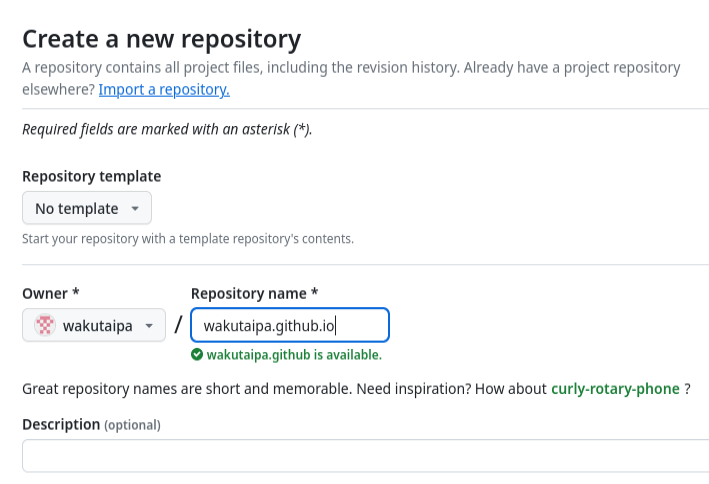
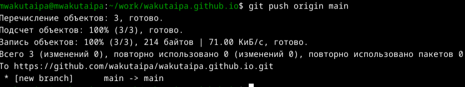
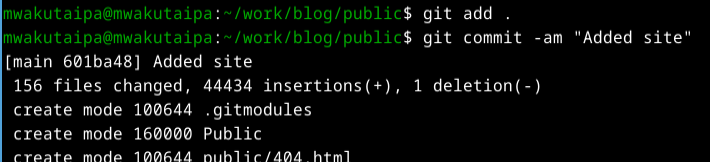

---
## Front matter
title: "Отчёт по индивидуальному проекту"
subtitle: "Архитектура компьютеров и операционные системы"
author: "Вакутайпа Милдред"

## Generic otions
lang: ru-RU
toc-title: "Содержание"

## Bibliography
bibliography: bib/cite.bib
csl: pandoc/csl/gost-r-7-0-5-2008-numeric.csl

## Pdf output format
toc: true # Table of contents
toc-depth: 2
lof: true # List of figures
fontsize: 12pt
linestretch: 1.5
papersize: a4
documentclass: scrreprt
## I18n polyglossia
polyglossia-lang:
  name: russian
  options:
	- spelling=modern
	- babelshorthands=true
polyglossia-otherlangs:
  name: english
## I18n babel
babel-lang: russian
babel-otherlangs: english
## Fonts
mainfont: PT Serif
romanfont: PT Serif
sansfont: PT Sans
monofont: PT Mono
mainfontoptions: Ligatures=TeX
romanfontoptions: Ligatures=TeX
sansfontoptions: Ligatures=TeX,Scale=MatchLowercase
monofontoptions: Scale=MatchLowercase,Scale=0.9
## Biblatex
biblatex: true
biblio-style: "gost-numeric"
biblatexoptions:
  - parentracker=true
  - backend=biber
  - hyperref=auto
  - language=auto
  - autolang=other*
  - citestyle=gost-numeric
## Pandoc-crossref LaTeX customization
figureTitle: "Рис."
listingTitle: "Листинг"
lofTitle: "Список иллюстраций"
lolTitle: "Листинги"
## Misc options
indent: true
header-includes:
  - \usepackage{indentfirst}
  - \usepackage{float} # keep figures where there are in the text
  - \floatplacement{figure}{H} # keep figures where there are in the text
---

# Цель работы

Быстрое развертывание сайта на GitHub Pages с помощью генератора статического html Hugo.

# Задание

- Установка программного обеспечения
- Установка темы
- Публикация сайта

# Выполнение лабораторной работы

## Установка программного обеспечения

Установливаю программу вручную с репозитория на Github:

{#fig:001 width=70%}

Распаковаю программу и копирую её в bin:

{#fig:002 width=70%}

По шаблону Academic-cv создаю новый репозиторий blog:

{#fig:003 width=70%}

Клонирую репозиторий, который содержит структуру сайта в каталог work/blog :

{#fig:004 width=70%}

Перехожу в этот же каталог и проверяю с помощью ls -l:

{#fig:005 width=70%}

## Установка темы

Запускаю hugo:

{#fig:006 width=70%}

Запускаю программу с командой server, чтобы видеть сайт на локальный сервер:

{#fig:007 width=70%}

{#fig:008 width=70%}

Создаю еще один репозиторий имя, которое является адресом сайта:

{#fig:009 width=70%}

Клонирую созданный репозиторий, который храняется у себя в каталог wakutaipa.github.io:

{#fig:0010 width=70%}

Создаю новую ветку с именем main:

{#fig:0011 width=70%}

## Публикация сайта

Создаю пустой файл readme.md и отправляю на глобальный репозиторий:

{#fig:0012 width=70%}

Комментирую public с помощью mc в .gitignore чтобы каталоги с таким названием не игнорировались:

{#fig:0013 width=70%}

Добавляю репозиторий к каталогу с помощью git submodule add:

{#fig:0014 width=70%}

Запускаю hugo, чтобы заполнить созданный каталог:

{#fig:0015 width=70%}

Провеяю подключение между созданным каталогом и wakutaipa.github.io:

{#fig:0016 width=70%}

Далее отправляю все файлы на github:

{#fig:0017 width=70%}

{#fig:0018 width=70%}

{#fig:0019 width=70%}

# Выводы

При выполнении данной работы я научилась, как развмещать сайт на GitHub Pages с помощью генератора статического html Hugo.

# Список литературы{.unnumbered}

[Creating Hugo Site](https://yamadharma.github.io/ru/post/2022/04/12/creating-hugo-site/)
