---
## Front matter
lang: ru-RU
title: Второй этап индивидуального проекта
subtitle: Добавление достижения к сайту
author:
  - Вакутайпа М.
institute:
  - Российский университет дружбы народов, Москва, Россия
date: 01 апреля 2024

## i18n babel
babel-lang: russian
babel-otherlangs: english

## Formatting pdf
toc: false
toc-title: Содержание
slide_level: 2
aspectratio: 169
section-titles: true
theme: metropolis
header-includes:
 - \metroset{progressbar=frametitle,sectionpage=progressbar,numbering=fraction}
 - '\makeatletter'
 - '\beamer@ignorenonframefalse'
 - '\makeatother'
---

# Информация

## Докладчик

:::::::::::::: {.columns align=center}
::: {.column width="70%"}

  * Вакутайпа Милдред
  * студентка НКА 02-23
  * Факультет физико-математических и естественных наук
  * Российский университет дружбы народов
  * [1032239009@rudn.ru](mailto:1032239009@rudn.ru)
  * <https://wakutaipa.github.io/ru/>

:::
::: {.column width="30%"}
:::
::::::::::::::

# Список достижения:

## Добавление информации о навыках

Я перешла в какталог ~/work/blog/content/authors/admin и редактировала файл _index.md:

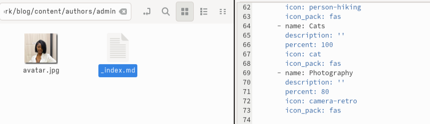{#fig:002 width=70%}

## Добавление информации о навыках

Я добавила технические навыки и хобби:

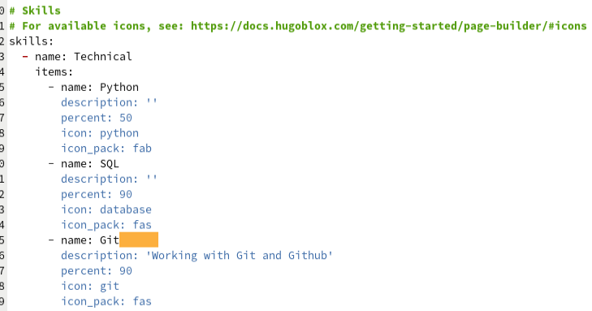{#fig:003 width=70%}

## Добавление информации о навыках

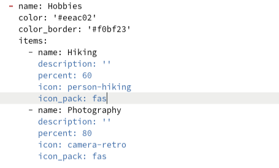{#fig:004 width=70%}

## Добавление информации о навыках

На локальном сервере я проверила изменении:

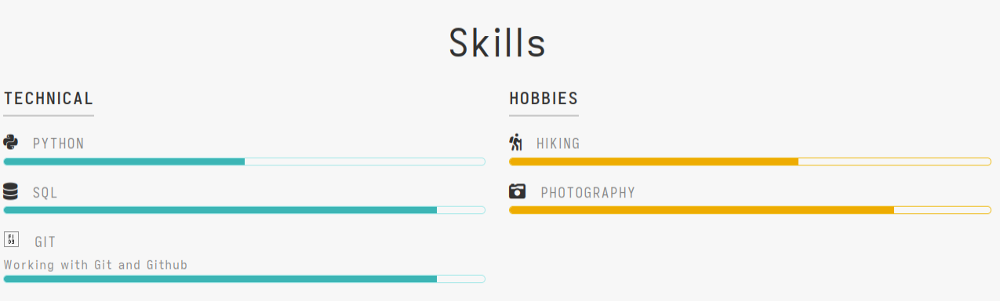{#fig:005 width=70%}

## Добавить информацию об опыте

Чтобы добавить информацию об опыте, я перешла в ~/work/blog/content и открыла файл _index.md для редактировния:

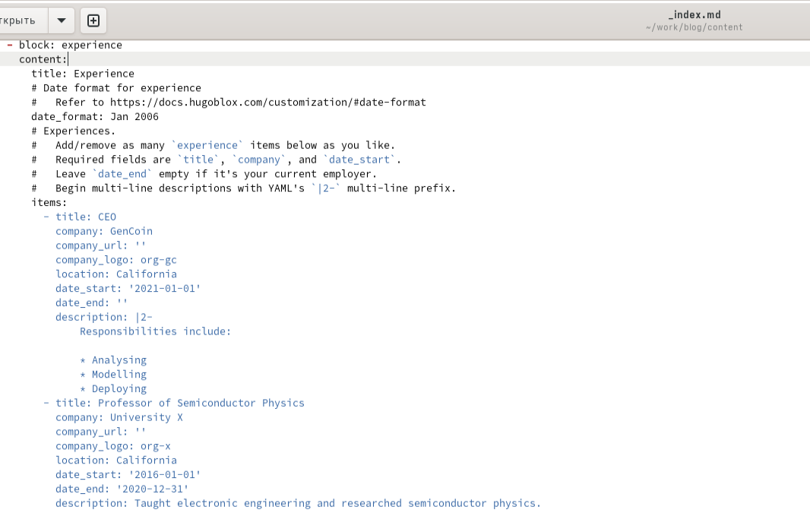{#fig:006 width=70%}

## Добавить информацию об опыте

Я заменила существующую информфцию на свою собственную: 

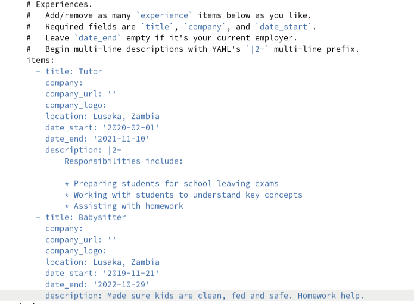{#fig:007 width=70%}

## Добавить информацию об опыте

На локальном сервере я проверила изменении:

{#fig:008 width=70%}

## Добавить информацию о достижениях

В том же файле, где я добавила информацию об опыте, я заменяю информацию о достижениях на свою:

{#fig:009 width=70%}

## Добавить информацию о достижениях

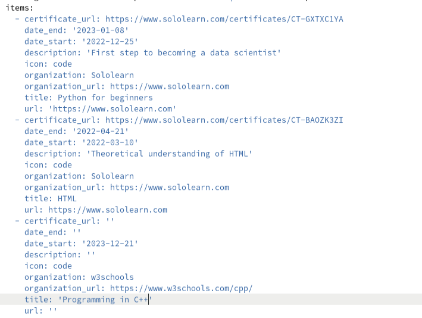{#fig:0010 width=70%}

# Пост по прошедщей неделе

Я создала папку lastweekofMarch и в ней вставила фотографию и файл index.md:

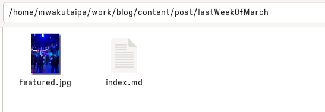{#fig:0011 width=70%}

## Пост по прошедщей неделе

Затем я редактировала файл index.md:

{#fig:0012 width=70%}

# Пост на тему по выбору

Я создала папку Markdown и в ней вставила фотографию и файл markdown.md:

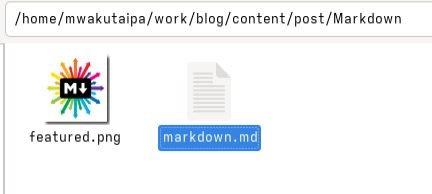{#fig:0013 width=70%}

## Пост на тему по выбору

Затем я редактировала файл markdown.md:

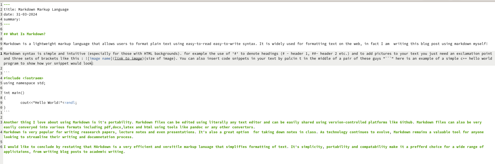{#fig:0014 width=70%}

## Пост на тему по выбору

На локальном сервере я проверила изменении:

{#fig:0015 width=70%}

# Сохранение изменений на сайте

Я перенесла все изменения в репозиторий блога моего github:

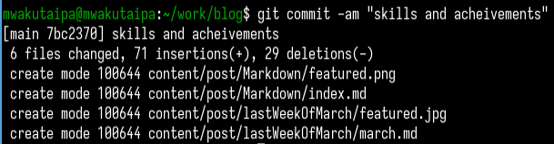{#fig:0016 width=70%}

## Сохранение изменений на сайте

Я перешла в каталог public и перенесла все изменения в репозиторий сайта моего github:

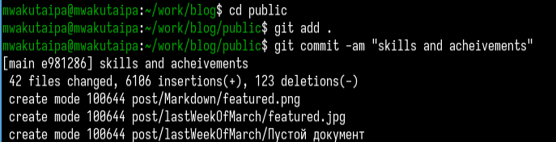{#fig:0017 width=70%}

